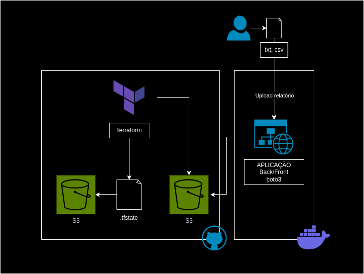
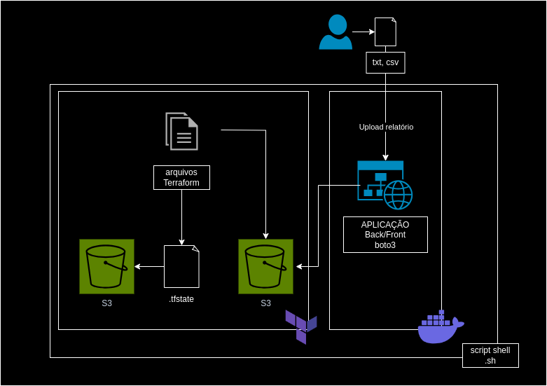
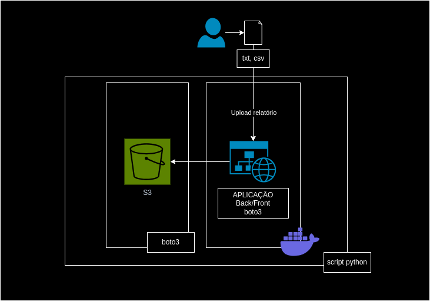

# Sobre

Este projeto tem o objetivo de criar uma automação que possa incluir relatórios garantindo resiliência, segurança e alta disponibilidade. Além de usar serviços da AWS.

## Arquitetura

Usando os serviços das AWS e infraestrutura como código (IaC) segue a arquitetura do projeto atual.





Entretanto é possível rodar o projeto de três formas, forkando o repositório e utilizando CI/CD do Github Actions, rodar localmente via script shell usando Terraform ou via script python usando a biblioteca `boto3`.

### 1. Utilizando Github Actions + Terraform

## Pré-requisito
Antes de começar, é necessário criar um usuário no AWS IAM com permissão AmazonS3FullAccess e gerar uma chave de acesso. Além disso, é preciso criar um bucket no S3.

Esses dados serão utilizados na aplicação python.

É importante ter o docker instalado e o docker-compose.

### Configuração CORS

Para configurar o CORS, siga estes passos:

1. Acesse as configurações do seu bucket no console da AWS.
2. Vá para a seção "Permissões" e clique em "CORS".
3. Cole o código abaixo:

```
[
    {
        "AllowedHeaders": [
            "*"
        ],
        "AllowedMethods": [
            "PUT",
            "POST"
        ],
        "AllowedOrigins": [
            "*"
        ],
        "ExposeHeaders": []
    }
]
```


## Configuração de variáveis

1. A partir do arquivo `env-example` crie um arquivo `.env` e subistitua a variável do nome do bucket.

2. Na pasta `.aws` você encontra os arquivos exemplos para colocar as credenciais de **access key id** e **secret access key**. Esses arquivos podem ser encontrado no contâiner no caminho `~/.aws` equivalente ao `/root/.aws/`

3. Para executar a aplicação entre na pasta projeto_aws e rode o comando:

`docker-compose up --build`


### 2. Script shell

1. Arquitetura:




### 3. Script python + boto3

1. Arquitetura:

